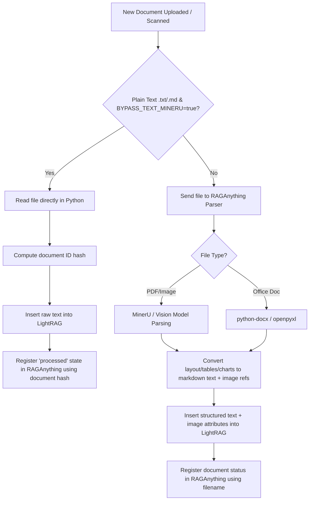
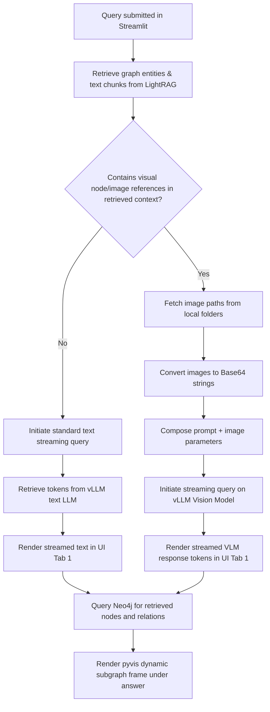

# 🧬 Architecture & Components Guide (Onboarding)

Welcome to the **Advanced Graph RAG Dashboard** project! This guide is designed to help you understand the architectural layout, core modules, data flows, and configuration boundaries of this system.

---

## 📌 Project Overview

This repository provides an integrated local **Multimodal Graph RAG pipeline** and interactive **Neo4j Dashboard**. It combines two primary research frameworks:
1. **LightRAG** (Inner Layer): Handles core chunking, embedding generation, graph extraction, vector databases, local/global/hybrid retrieval, and query processing.
2. **RAG-Anything** (Outer Layer): Wraps LightRAG to support multimodal input ingestion (PDF layout extraction via MinerU, image processing, table parsing, and vision-model captioning).

The database backend is **Neo4j** (running locally via Docker Compose), and all models (text LLM, vision model, and text embedding) are served locally by **vLLM**.

---

## 📂 Directory Structure

Below is the layout of the project, highlighting the core folders and their roles:

```text
project_agv/
├── config/                  # Logging and sanity check configurations
│   ├── logging_config.py    # Rotating file + stderr logging setup
│   └── preflight.py         # vLLM connectivity and model verification
├── docs/                    # Ingestion source directory (contains raw files like book.txt)
├── docs/book.txt            # Default source document (Alice in Wonderland or novel snippet)
├── ingest/                  # Data ingestion pipelines
│   ├── file_ingest.py       # RAGAnything multimodal file router (.pdf, .docx, images, etc.)
│   └── text_ingest.py       # Plain text (.txt, .md) bypass pipeline for high performance
├── lib/                     # Static UI assets (tom-select, vis-9.1.2) for viz rendering
├── query/                   # Retrieval and querying handlers
│   └── query_runner.py      # Multi-mode query execution and VLM streaming adapters
├── rag/                     # Core RAG initialization and model configurations
│   ├── embeddings.py        # vLLM embedding wrapper (OpenAI-compatible)
│   ├── lightrag_init.py     # LightRAG settings and entity scheme setup
│   ├── llm.py               # vLLM LLM and VLM prompt/extraction controllers (OpenAI-compatible)
│   ├── raganything_init.py  # Option B RAGAnything injection wiring
│   └── reranker.py          # Cross-encoder and FlagReranker modules (GPU/FP16)
├── storage/                 # Local directory for persistent data stores
│   ├── dickens_v1/          # Default LightRAG working directory (KV json stores, vector indexes)
│   └── neo4j/               # Persistent Neo4j files (volumes mapped in docker-compose)
├── viz/                     # Data visualization module
│   └── graph_viz.py         # PyVis interactive dark-theme HTML network builder
├── .env                     # System configurations (LLM name, Neo4j password, folders)
├── app.py                   # Streamlit dashboard entry point (UI Tabs 1 - 4)
├── docker-compose.yml       # Neo4j service composition
├── main.py                  # CLI pipeline entry point (fresh runs, smoke testing, query test)
└── requirements.txt         # Project dependencies (excluding LightRAG/RAGAnything editable installs)
```

---

## ⚙️ Component Details

### 1. Web Interface: `app.py`
The dashboard is built on **Streamlit** and serves as the visual interface. It is divided into 4 tabs:
* **Tab 1: RAG & Graph Retrieval**: Submits user queries to the RAG pipeline. Displays streamed answers and renders a localized pyvis interactive network map of retrieved nodes and relations.
* **Tab 2: Neo4j Graph Manager**: Provides database status indicators, real-time node/relationship statistics, a direct Cypher execution console, and a reset utility (wiping both Neo4j and local caches).
* **Tab 3: Document Ingestion**: Supports uploading documents. Tail logs stream on screen to show layout extraction, parsing, and embedding progress.
* **Tab 4: Complete Graph Explorer**: Renders the complete graph from Neo4j/NetworkX. It includes filters (node search, neighbor hop bounds, entity types) and rendering speed limits to keep browser canvas frames high.

#### ⚠️ Critical Design Pattern: Persistent Event Loop
Streamlit runs the script from top to bottom on every user action. If standard async functions were executed normally, background tasks and network pools would repeatedly create/close, leading to `Event loop is closed` errors.
To solve this, `app.py` caches a background loop and thread:
```python
@st.cache_resource
def get_background_loop():
    loop = asyncio.new_event_loop()
    t = threading.Thread(target=lambda l: l.run_forever(), args=(loop,), daemon=True)
    t.start()
    return loop
```
All async RAG executions are scheduled on this single persistent background loop using `asyncio.run_coroutine_threadsafe()`.

---

### 2. CLI Ingestion & Testing: `main.py`
The command-line entry point. Running `python main.py` runs a complete pipeline:
1. Verify vLLM connectivity and model availability.
2. Initialize LightRAG and wrap it with RAGAnything.
3. Perform an embedding smoke-test to verify vector sizes.
4. Scan the `./docs` directory and ingest new files.
5. Query the database using naive, local, global, and hybrid search methods sequentially, printing the streamed outputs.

Pass the `--fresh` flag to purge old local index files before starting:
```bash
python main.py --fresh
```

---

### 3. Ingestion Layer: `ingest/`
* **`file_ingest.py`**: Integrates with `RAGAnything.process_document_complete()`. Handles layout conversion for PDF and Office files and captions visual files (images/charts) via the vision model.
* **`text_ingest.py`**: A **direct text bypass pipeline**. Parsing plain text files (`.txt`, `.md`) through MinerU OCR is slow and unnecessary. When `BYPASS_TEXT_MINERU=true` is set in `.env`, these files are passed directly to `LightRAG.ainsert()`. 
  * *Alignment Detail:* The bypass pre-computes the document ID hash exactly like LightRAG does: `compute_mdhash_id(sanitize_text_for_encoding(content), prefix="doc-")` to register the file status under the same key in RAGAnything, preventing status record duplication.

---

### 4. Retrieval & Query: `query/`
* **`query_runner.py`**: Runs CLI multi-mode testing and custom retrieval streaming.
  * *VLM Streaming Adapter (`aquery_with_vlm_stream`):* `RAGAnything`'s default `aquery_vlm_enhanced` blocks token-by-token streaming response generation. To circumvent this, the custom wrapper queries LightRAG with `only_need_prompt=True` to fetch retrieved text and image paths, encodes retrieved images as base64, and initiates an async streaming session to vLLM's vision model via OpenAI-compatible API. If no images exist in the retrieval context, it gracefully falls back to text-only streaming.

---

### 5. RAG Engine: `rag/`
* **`lightrag_init.py`**: Configures the underlying LightRAG storage engines, worker timeouts, chunk sizes, and database bindings.
  * *Schema Customization:* Rather than using standard `"person", "location", "organization"`, it registers an expanded entity schema: `["Person", "Creature", "Organization", "Location", "Event", "Concept", "Method", "Artifact", "NaturalObject"]`.
* **`llm.py`**: Configures model parameters and formats custom extraction constraints.
  * *Entity Extraction Guardrails (`ENTITY_EXTRACTION_ADDENDUM`):* Modifies the extraction prompt to allow collecting high-level abstract concepts/themes (e.g., *"Industrialization"*, *"Poverty"*, *"Binary Search"*) while maintaining strict negative filters for everyday trivial clutter (e.g., *"Mashed Potatoes"*, *"Wicker Baskets"*).
* **`embeddings.py`**: Builds the `EmbeddingFunc` mapped to vLLM (OpenAI-compatible). It accesses `.func` to retrieve the original async callable from the decorated `openai_embed`, avoiding recursive double-wrapping errors.
* **`raganything_init.py`**: Wraps LightRAG inside `RAGAnything` (Option B: injected constructor).
* **`reranker.py`**: Houses GPU-accelerated rerankers (sentence-transformers `CrossEncoder` and BAAI `FlagReranker`). Reranking is off by default and can be toggled by changing `ENABLE_RERANK = True` in `reranker.py`.

---

### 6. Visualization: `viz/`
* **`graph_viz.py`**: Leverages **PyVis** to render physics-driven network graphs from NetworkX objects into standalone HTML files.
  * *Color Strategy:* Pins specific colors for known nodes (e.g., Person, Org, Chunk, Image, Table). For other custom entity types, it dynamically assigns unique hues from `AUTO_PALETTE` based on the graph data discoverable at runtime.
  * *Cross-Modal Edges:* Multimodal relationships (like `IMAGE_DESCRIBES`) are rendered with unique styles (dashed, customized colors).

---

## 🔄 Core Data Flows

### Ingestion Flow


### Query & Stream Retrieval Flow


---

## 💡 Quick Tips for New Contributors
1. **Editable submodules**: Ensure that you have run `pip install -e ./LightRAG` and `pip install -e ./RAG-Anything`. These packages are edited locally, so modifying their repositories directly will change their behaviors.
2. **Neo4j logs & data**: The Neo4j volumes are stored in `storage/neo4j`. Wiping this directory completely resets the database status outside docker container destruction.
3. **Log checking**: The background ingestion processes write directly to `rag_pipeline.log`. Keep a terminal window open running `tail -f rag_pipeline.log` to watch real-time indexing errors.
