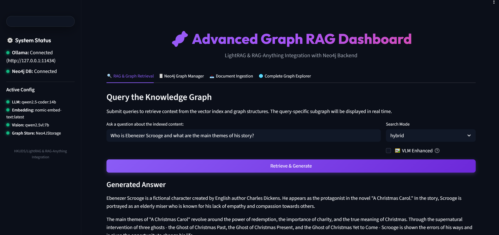

# 🧬 Advanced Graph RAG Dashboard



An integrated Graph RAG and Neo4j Streamlit dashboard combining the capabilities of **HKUDS/LightRAG** and **HKUDS/RAG-Anything** using a local Neo4j database and local LLMs hosted on Ollama.

> [!TIP]
> **New to the project?** Read the [Architecture & Components Guide (COMPONENTS.md)](COMPONENTS.md) to understand the codebase layout, data flows, and design details.

---

## 🚀 Quick Start Guide

### 1. Clone this Repository
```bash
git clone https://github.com/Muntaha15/multimodal_LightRag_application.git
```

### 2. Clone the Required Libraries
Since `LightRAG` and `RAG-Anything` are excluded from Git tracking, you must clone them directly into the root folder:
```bash
git clone https://github.com/HKUDS/LightRAG.git
git clone https://github.com/HKUDS/RAG-Anything.git
```

### 3. Install Dependencies
Activate your python/conda environment and install the requirements:
```bash
pip install -r requirements.txt
pip install -e ./LightRAG
pip install -e ./RAG-Anything
```

### 4. Start Infrastructure
* **Ollama:** Start Ollama and pull the required models:
  ```bash
  ollama serve
  ollama pull qwen2.5-coder:14b
  ollama pull qwen2.5vl:7b
  ollama pull nomic-embed-text:latest
  ```
* **Neo4j Database:** Spin up the database docker container:
  ```bash
  docker compose up -d
  ```

### 5. Configure Environment
Create a `.env` file in the root folder with the following configuration:
```env
# Models
LLM_MODEL=qwen2.5-coder:14b
EMBEDDING_MODEL=nomic-embed-text:latest
VISION_MODEL=qwen2.5vl:7b

# Binding Hosts
LLM_BINDING_HOST=http://localhost:11434
EMBEDDING_BINDING_HOST=http://localhost:11434

# Storage
WORKING_DIR=./storage/dickens_v1
GRAPH_STORAGE=Neo4JStorage

# Neo4j Details
NEO4J_URI=bolt://localhost:7687
NEO4J_USERNAME=neo4j
NEO4J_PASSWORD=password
NEO4J_DATABASE=neo4j
```

### 6. Index Content & Start Dashboard
* **Initial Indexing:**
  ```bash
  python main.py --fresh
  ```
* **Start UI Dashboard:**
  ```bash
  streamlit run app.py --server.port 8501 --server.address 0.0.0.0
  ```

For more detailed verification and step-by-step instructions, please read the manual [guide.md](guide.md). For codebase layout and data flows, check the [COMPONENTS.md](COMPONENTS.md) onboarding guide.
